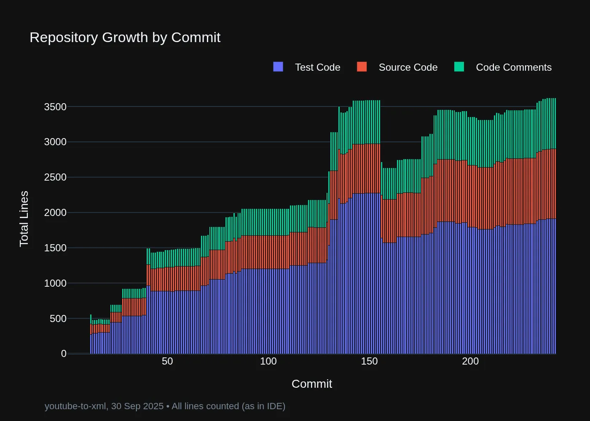
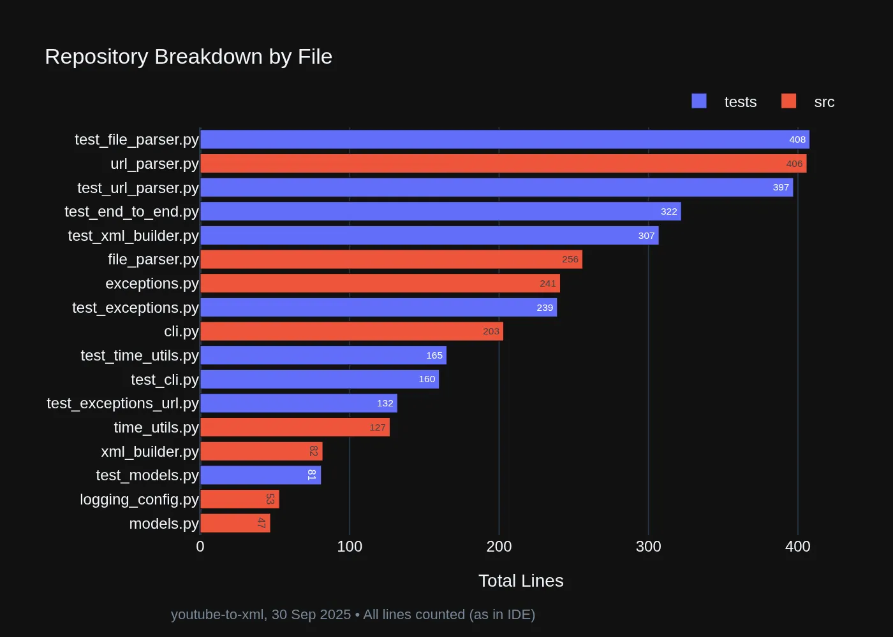

# 📊 Plot Py Repo

Visualise Python repository evolution through Git history.

Context is everything with coding with LLMs. Visualise your repo to understand where and how the context is spread. Use existing charts, add your own, or analyse the raw data. See [example output](example-output/).

## Example Charts

*Generated by analysing the [github.com/michellepace/youtube-to-xml](https://github.com/michellepace/youtube-to-xml) repository.*

<p align="left">
  <a href="example-output/repo_evolution_commit.webp">
    
  </a>
  <br>
  <em>Figure 1 of 3: Growth by commit</em>
</p>
<br>

<p align="left">
  <a href="example-output/repo_breakdown.webp">
    
  </a>
  <br>
  <em>Figure 2 of 3: Latest commit, file by file</em>
</p>
<br>

## 📈 What It Tracks

Traverses Git history commit-by-commit, reconstructing the full file tree at each commit and analysing every Python file in `src/` and `tests/`. Comments and docstrings are considered documentation (not code) and classified together as "code comments".

<p align="left">
  <a href="example-output/line-counting-rules.jpg">
    
  </a>
  <br>
  <em>Figure 3 of 3: How lines are counted</em>
</p>
<br>

Key principles:

- Total lines — matches what you see in your IDE (includes blank lines)
- Docstring lines — Module, class, and function docstrings identified via AST
- Comment lines — Standalone `#` comments only (inline comments count as code)
- Code lines — Everything else, including blank lines

Docstrings come from Python's AST, comments from its tokeniser. Together they guarantee the three counts always sum exactly to the total. `__init__.py` is recorded in the CSV but left out of the charts.

## 📦 Install

(1) First, install uv <https://docs.astral.sh/uv/getting-started/installation/>.

(2) Then, install `plot-py-repo` to make it accessible from anywhere in your terminal:

```bash
uv tool install git+https://github.com/michellepace/plot-py-repo.git
```

## 🚀 Usage

Analyse any Python repository:

```bash
# Analyse current directory
plot-py-repo

# Analyse specific repository
plot-py-repo /path/to/your-repo

# Regenerate charts from existing CSV
plot-py-repo --csv history.csv

# Save outputs to custom directory
plot-py-repo --output-dir ./reports

# View all options
plot-py-repo --help
```

Output files, written to the current directory (or `--output-dir`):

- [`repo_history.csv`](example-output/repo_history.csv) - One row per file per commit
- [`repo_evolution.webp`](example-output/repo_evolution.webp) - Growth over calendar time
- [`repo_evolution_commit.webp`](example-output/repo_evolution_commit.webp) - Growth by commit
- [`repo_breakdown.webp`](example-output/repo_breakdown.webp) - File sizes at the latest commit

## 🛠️ Development

Clone and set up:

```bash
git clone https://github.com/michellepace/plot-py-repo.git
cd plot-py-repo
uv sync
uv run plot-py-repo /path/to/repo
```

Quality checks:

```bash
uv run ruff check --fix           # Lint and auto-fix
uv run ruff format                # Format code
uv run pyright                    # Type check
uv run pytest                     # Run all tests
uv run pre-commit run --all-files # Run all hooks
```

**Tech Stack**: Python 3.14+, Plotly Express, Pandas, Kaleido • See [`.claude/CLAUDE.md`](.claude/CLAUDE.md)

**No Git library**: history is read with plain `git ls-tree` and `git show` calls

**Test Driven Development**: 59 tests (5 slow, 54 unit, ~18 seconds)

**Strict by default**: Ruff with all rules enabled, Pyright, and pre-commit running the full suite on every commit

## 🏗️ Architecture

```text
  🔄 DATA FLOW: Git Repo → CSV → DataFrame → WebP Charts
  --

  ┌─────────────────────────────────────────────────────────────┐
  │                          cli.py                             │
  │              Parse args & orchestrate workflow              │
  └───────┬─────────────────────────────────────┬───────────────┘
          │                                     │
          │ Git Analysis                        │ Visualisation
          ▼                                     ▼
  ┌──────────────────┐              ┌─────────────────────────┐
  │  git_history.py  │              │     visualise.py        │
  │                  │              │                         │
  │  Walk commits,   │              │  Load CSV, filter,      │
  │  extract files,  │─────CSV─────▶│  delegate to charts     │
  │  classify lines, │              │                         │
  │  write CSV       │              └────────┬────────────────┘
  └────────┬─────────┘                       │
           │                                 │
           │ uses                            │ calls
           ▼                                 ▼
  ┌──────────────────┐              ┌─────────────────────────┐
  │  count_lines.py  │              │     chart_*.py          │
  │                  │              │   (3 modules)           │
  │  Pure function:  │              │                         │
  │  classify Python │              │  Transform data,        │
  │  lines into      │              │  create Plotly charts,  │
  │  code/docs/      │              │  save as WebP           │
  │  comments        │              │                         │
  └──────────────────┘              └────────┬────────────────┘
                                             │ uses
                                             ▼
                                    ┌─────────────────────────┐
                                    │     theme_plotly.py     │
                                    │                         │
                                    │  Shared theming &       │
                                    │  image export helpers   │
                                    └─────────────────────────┘

```

One level deeper in [`docs/architecture/arch-03.md`](docs/architecture/arch-03.md): execution flow, the CSV schema, and the contract every chart module follows.
