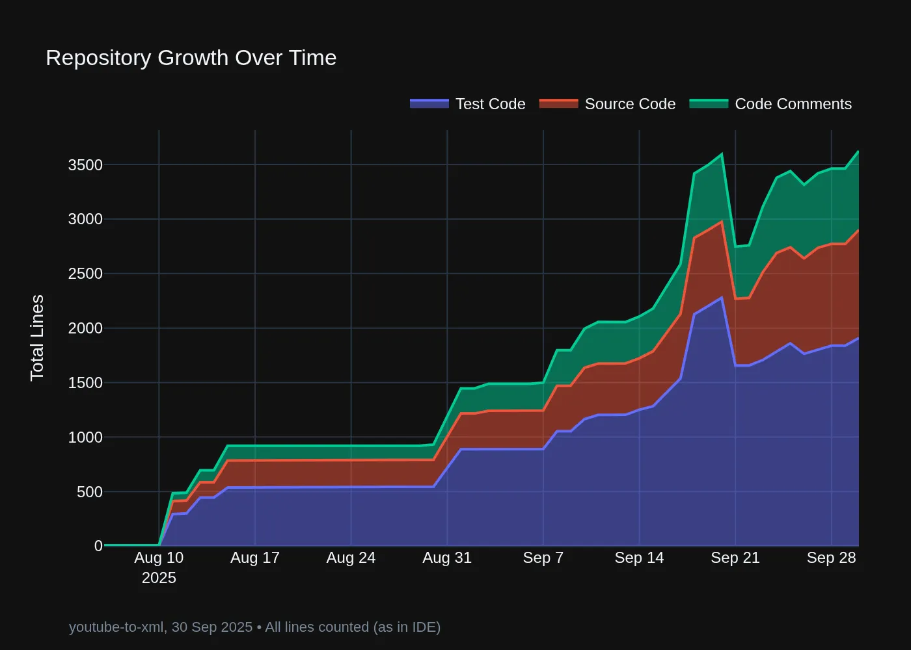

# 📊 Plot Py Repo

Visualise Python repository evolution through Git history.

**Why This Matters**: In the age of AI coding agents, see where your tokens are going. Track codebase growth to understand context consumption and manage what AI agents need to load.

## Example Charts




Generated from analysing the target repository [youtube-to-xml](https://github.com/michellepace/youtube-to-xml).

## 📈 What It Tracks

Chart Categories:

- **Test Code**: All lines from `tests/` directory (includes blanks)
- **Source Code**: All lines from `src/` directory (includes blanks)
- **Code Comments**: Docstrings + inline comments from all files

Methodology:

- All lines counted (matches IDE view, includes blank lines)
- Excluded: `__init__.py` files (typically small, reduces noise)
- Traverses Git history commit-by-commit analysing Python files

## 📦 Install

(1) First, install UV Python Package and Project Manager [from here](https://docs.astral.sh/uv/getting-started/installation/).

(2) Then, install `plot-py-repo` accessible from anywhere in your terminal:

```bash
uv tool install git+https://github.com/michellepace/plot-py-repo.git
```

## 🚀 Usage

Analyse any Python repository:

```bash
# Analyse current directory
plot-py-repo

# Analyse specific repository
plot-py-repo /path/to/your-repo

# Regenerate charts from existing CSV
plot-py-repo --csv history.csv

# Save outputs to custom directory
plot-py-repo --output-dir ./reports

# View all options
plot-py-repo --help
```

Example Output Files:

- [`repo_history.csv`](demo_output/repo_history.csv) - Complete Git history data
- [`repo_evolution.webp`](demo_output/repo_evolution.webp) - Timeline chart showing growth
- [`repo_breakdown.webp`](demo_output/repo_breakdown.webp) - Bar chart showing file sizes

## 🛠️ Development

Clone and setup:

```bash
git clone https://github.com/michellepace/plot-py-repo.git
cd plot-py-repo
uv sync
uv run plot-py-repo /path/to/repo
```

Quality checks:

```bash
uv run ruff check --fix           # Lint and auto-fix
uv run ruff format                # Format code
uv run pyright                    # Type check
uv run pytest                     # Run all tests
uv run pre-commit run --all-files # Run all hooks
```

**Tech Stack**: Python 3.13+, Plotly Express, Pandas, Kaleido • See [CLAUDE.md](CLAUDE.md) for architecture details
